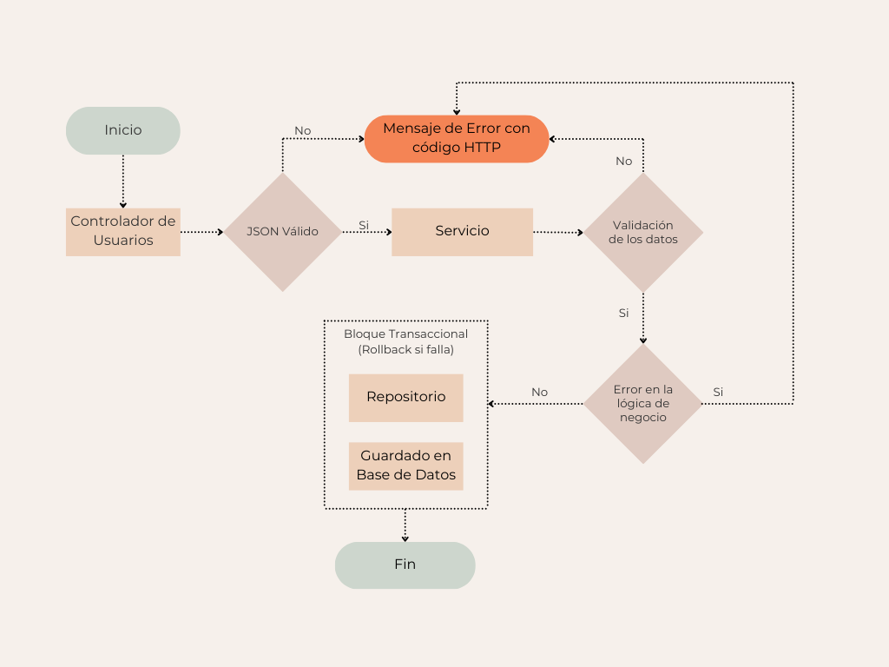

# 📘 API de Gestión de Usuarios

Esta API permite gestionar usuarios de una plataforma, incluyendo operaciones de creación, lectura, actualización, activación y desactivación. Está desarrollada con Java Spring Boot y expone endpoints RESTful.

## 🔧 Tecnologías

- Java 17
- Spring Boot
- Spring Data JPA
- Hibernate Validator
- Lombok
- Swagger/OpenAPI 3
- JWT
- Base de datos en memoria H2

---

## 🏛️ Arquitectura General

La arquitectura de esta API de Gestión de Usuarios sigue un enfoque multicapa para garantizar escalabilidad, mantenibilidad y separación de responsabilidades. A continuación se muestra un diagrama que describe cómo interactúan los componentes principales:



### Componentes Principales:

- **Controller**: Expone los endpoints RESTful y recibe las solicitudes del cliente.
- **Service**: Contiene la lógica de negocio, validaciones y orquestación entre capas.
- **Repository**: Interactúa directamente con la base de datos utilizando Spring Data JPA.
- **Modelos/DTOs**: Transportan los datos entre capas y estructuran la entrada/salida.
- **Excepciones Personalizadas**: Controlan flujos de error como correo duplicado, validaciones, etc.
- **Utilidades**: Constantes, validaciones, manejo de tokens JWT.

Este diseño promueve el desacoplamiento y facilita la implementación de pruebas unitarias y de integración.

---

## 📦 Endpoints principales

| Método | Endpoint                   | Descripción                               |
|--------|----------------------------|-------------------------------------------|
| POST   | `/api/users`               | Crear nuevo usuario                       |
| PUT    | `/api/users/{id}`          | Actualizar usuario                        |
| GET    | `/api/users`               | Obtener todos los usuarios                |
| GET    | `/api/users/email/{email}` | Obtener un usuario por correo electrónico |
| DELETE | `/api/users/{id}`          | Desactivar usuario                        |
| PATCH  | `/api/users/{id}/activate` | Activar usuario                           |
| GET    | `/api/logs`                | Obtiene los registros de Logs generados   |

---

## 🛠️ Instalación

1. Clona el repositorio:

```bash
git clone https://github.com/Asktonicus/prueba-ntt.git
```
2. Navega al directorio del proyecto:
```bash
cd repositorio
```
3. Compila e instala las dependencias:
```bash
./mvnw install
```
4. Ejecuta la aplicación:
```bash
./mvnw spring-boot:run
```
---

## 📄 Formatos Soportados

### 📧 **Correo Electrónico**
El correo electrónico debe cumplir con el siguiente formato:

**Expresión Regular**: ^[\w.-]+@[\w.-]+\.[a-zA-Z]{2,}$

**Descripción**:
- Solo se permiten caracteres alfanuméricos, puntos (.), guiones (-) y el símbolo de arroba (@) en el nombre del usuario y el dominio.
- El dominio debe ser seguido por un punto (.) y luego la extensión, que debe tener al menos 2 caracteres.

**Ejemplo Válido**:
- `usuario@dominio.com`
- `ejemplo.email@sub.dominio.org`

**Ejemplo Inválido**:
- `usuario@dominio`
- `usuario@dominio.c`

---

### 🔐 **Contraseña**
La contraseña debe cumplir con los siguientes requisitos:

**Expresión Regular**: ^(?=.[A-Z])(?=.\d)[A-Za-z\d@$!%*?&]{8,}$

**Descripción**:
- La contraseña debe tener al menos **8 caracteres**.
- Debe contener al menos **una letra mayúscula**.
- Debe contener al menos **un número**.
- Puede incluir caracteres especiales como: `@$!%*?&`.

**Ejemplo Válido**:
- `Contrasena1!`
- `Password123@`

**Ejemplo Inválido**:
- `12345`
- `password`

---

## 📚 Detalle de Endpoints

Base URL: `/api/users`

### ➕ Crear Usuario

`POST /api/users`

Crea un nuevo usuario.

**Request body:**
```json
{
  "name": "Juan Rodriguez",
  "email": "juan@rodriguez.org",
  "password": "Contrasena1!",
  "phones": [
    {
      "number": "1234567",
      "citycode": "1",
      "countrycode": "57"
    }
  ]
}
```

**Respuestas:**
- `201 Created`: Usuario creado exitosamente
- `400 Bad Request`: Correo ya registrado o datos inválidos

---

### 📄 Obtener Todos los Usuarios

`GET /api/users`

Obtiene una lista paginada de todos los usuarios. Por defecto muestra una página de 10 registros.

**Parámetros opcionales:**
- `page` (int)
- `size` (int)
- `orden` (campo para ordenar)
- `estado` (`activos`, `inactivos`)

**Respuesta:**
- `200 OK`: Página de usuarios

---

### 📧 Buscar Usuario por Email

`GET /api/users/email/{email}`

Busca un usuario por su dirección de correo electrónico.

**Respuesta:**
- `200 OK`: Usuario encontrado
- `400 Bad Request`: Email inválido
- `404 Bad Request`: Email no encontrado

---

### 🔁 Actualizar Usuario

`PUT /api/users/{id}`

Actualiza datos de un usuario existente.

**Request body (parcial o completo):**
```json
{
  "name": "Nuevo Nombre",
  "email": "nuevo@email.com",
  "password": "Password123@"
}
```

**Respuesta:**
- `200 OK`: Usuario actualizado
- `400 Bad Request`: ID Inválido
- `404 Not Found`: Usuario no encontrado

---

### ❌ Desactivar Usuario

`DELETE /api/users/{id}`

Desactiva lógicamente a un usuario (soft delete).

**Respuesta:**
- `200 OK`: Usuario desactivado
- `400 Bad Request`: ID Inválido
- `404 Not Found`: Usuario no encontrado

---

### ✅ Activar Usuario

`PATCH /api/users/{id}/activate`

Activa un usuario previamente desactivado.

**Respuesta:**
- `200 OK`: Usuario activado
- `400 Bad Request`: ID Inválido
- `404 Not Found`: Usuario no encontrado

---

### 🔍 Consulta de Logs

`GET /api/logs`

Consulta los logs generados al momento de Crear, Eliminar, Activar y/o Actualizar un usuario. Por defecto muestra una página de 10 registros.

**Parámetros opcionales:**
- `page` (int)
- `size` (int)
- `userId` (UUID)

**Respuesta:**
- `200 OK`: Página de logs


## 🛢️ Conexión a la Base de Datos H2
Durante el desarrollo, esta aplicación utiliza una base de datos en memoria H2. Puedes acceder a la consola web de H2 para explorar las tablas y datos de forma interactiva.

### 📍 URL de la Consola Web  
`http://localhost:8080/h2-console`

### 🔐 Configuración de conexión


| Parámetro    | Valor                    |
|--------------|--------------------------|
| Driver Class | `org.h2.Driver`          |
| JDBC URL     | `jdbc:h2:mem:usuariosdb` |
| User Name    | `sa`                     |
| Password     | `(vacio)`                |

💡 Asegúrate de que la consola H2 esté habilitada en `application.properties`:

`spring.h2.console.enabled=true`  
`spring.h2.console.path=/h2-console`

⚠️ Esta base de datos se reinicia cada vez que se apaga la aplicación.

---

## 🧪 Pruebas

El proyecto incluye pruebas unitarias con JUnit y Mockito. Para ejecutarlas:

```bash
./mvnw test
```

---

## 📝 Documentación

- Usa Swagger UI en `http://localhost:8080/swagger-ui/index.html` para explorar la API.

---

## ❌ Errores Comunes

Los siguientes son ejemplos de respuestas de error que pueden ocurrir al interactuar con la API:

- **400 Bad Request**: Cuando los datos enviados no cumplen con los requisitos (ej., formato de correo inválido).
- **404 Not Found**: Cuando no se encuentra un usuario con el ID o correo proporcionado.
- **500 Internal Server Error**: Cuando ocurre un error inesperado en el servidor.

---

## ✍️ Autor

Nicolás Cerda  
_ncerdaserey@gmail.com_  
Backend Developer
---